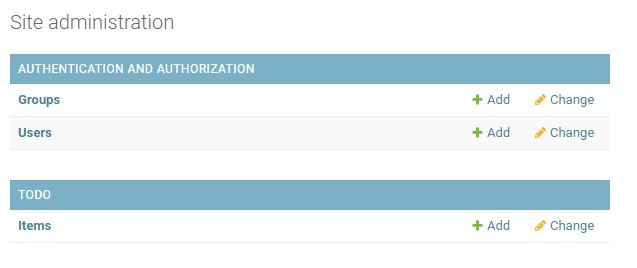
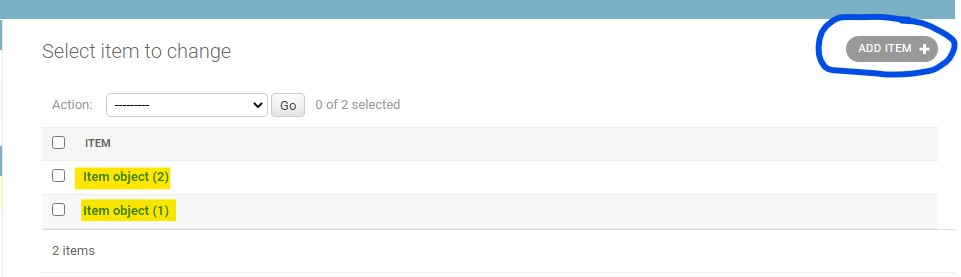
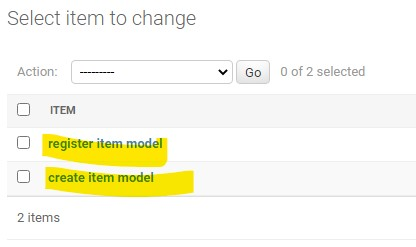

# MSP4 sand box

## Install [django](https://www.djangoproject.com/)
```pip3 install django```

> Installing collected packages: sqlparse, pytz, asgiref, django
> Successfully installed asgiref-3.3.1 django-3.1.5 pytz-2020.5 sqlparse-0.4.1

```django-admin startproject msp4_sandbox```

```django-admin startproject django_todo . ```

From [pwd] /workspace/MSP4_sandbox:

```cd msp4_sandbox```

 
```python3 manage.py runserver```

Port #8000 made public.

Runserver called for the first time creates a file db.sqlite3 and a __pycache__ directory.

>You have 18 unapplied migration(s). Your project may not work properly until you apply the migrations for app(s): admin, auth, contenttypes, sessions.
>Run 'python manage.py migrate' to apply them.

```python3 manage.py migrate```

### Apps

```python3 manage.py startapp msp4```

```python3 manage.py startapp todo```


Creates a subdirectory : msp4.
With python files:
- admin.py
- apps.py
- models.py
- tests.py
- views.py

#### views.py
``` 
from django.shortcuts import render, HttpResponse
# Create your views here.
def say_hello(request):
    return httpRequest("Hello!")
```

> How do we make this function available to the browser ? 

#### urls.py

```
from django.contrib import admin
from django.urls import path
from todo.views import say_hello

urlpatterns = [
    path('admin/', admin.site.urls),
    path('hello/', say_hello, name="Hello")
]
```

``` python3 manage.py runserver ```

Browser:

- 


``` https://8000-e6ab4b52-9510-4ae0-9182-4eb7e0bfc1e5.ws-eu03.gitpod.io/hello/ ```

- 


### Templates

Each app can have a templates folder.
Templates allow full html pages to be called by Django, rather than html lines.
It allows incorporation of CSS and JavaScript as well.

1. Go to the app folder and create a templates folder.
2. Within the templates folder create another folder called 'appname' (e.g. todo)
3. Within that directory create an html file, e.g. todo_list.html.

#### views.py

Instead of calling httpresponse with lines of html we can render a page.
```
def get_todo_list(request):
    return render(request, "todo/todo_list.html")
```    

#### urls.py

Now making a 'home' page by putting a blank path.

```from todo.views import say_hello, get_todo_list```


```
urlpatterns = [
    path('admin/', admin.site.urls),
    path('hello/', say_hello, name="Hello"),
    path("", get_todo_list, name="get_todo_list")
    ]
```


#### settings.py
[django_todo/settings.py]
Need to tell django there's a new template in town.

``` 
INSTALLED_APPS = [
    'django.contrib.admin',
    'django.contrib.auth',
    'django.contrib.contenttypes',
    'django.contrib.sessions',
    'django.contrib.messages',
    'django.contrib.staticfiles',
    'todo',
]
```


- 

### Migrations and admin

Migrations are Django's way of converting python code into database operations.

``` python3 manage.py makemigrations [--dry-run] ```

``` python3 manage.py showmigrations```

``` python3 manage.py migrate [--plan] ```

``` python3 manage.py createsuperuser ``` 
- prompts for 1) username; 2) email; 3) password/confirm password.

- 


### Models
Now that the database sqlite3 has been initialised for the project, can model some objects for it to hold.

#### models.py

```
from django.db import models


class Item(models.Model):
    name = models.CharField(max_length=50, null=False, blank=False)
    done = models.BooleanField(null=False, blank=False, default=False)
```

This model now needs to be implemented on the database.
```
gitpod /workspace/MSP4_sandbox $ python3 manage.py makemigrations --dry-run
Migrations for 'todo':
  todo/migrations/0001_initial.py
    - Create model Item
```

Now for real:
```python3 manage.py makemigrations```

This creates an sql file that will create the Items table within db.sqlite3.

[/workspace/MSP4_sandbox/todo/migrations/0001_initial.py]

```
    operations = [
        migrations.CreateModel(
            name='Item',
            fields=[
                ('id', models.AutoField(auto_created=True, primary_key=True, serialize=False, verbose_name='ID')),
                ('name', models.CharField(max_length=50)),
                ('done', models.BooleanField(default=False)),
            ],
        ),
    ]
```

Before this is enacted, just check that this is what was intended.

```
python3 manage.py migrate --plan
Planned operations:
todo.0001_initial
    Create model Item
```
#### run the migration
```
python3 manage.py migrate
Operations to perform:
  Apply all migrations: admin, auth, contenttypes, sessions, todo
Running migrations:
  Applying todo.0001_initial... OK
```

#### Need to register model to see

[todo] apps admin.py file:

```
from django.contrib import admin
from .models import Item

# Register your models here.
admin.site.register(Item)
```

Run the server now:
```python3 manage.py runserver```

The admin page will now show items:

- 

From this page you can add items to the database items object.

- 

The item names are not very meaningful.

#### models.py

```
class Item(models.Model):
    name = models.CharField(max_length=50, null=False, blank=False)
    done = models.BooleanField(null=False, blank=False, default=False)


    def __str__(self):
        return self.name
```
Refresh admin page will give:

- 

### Creating data: Crud

#### Rendering data on the web pages from the database: cRud

views.py

```
from django.shortcuts import render, HttpResponse
from .models import Item


# Create your views here.
def say_hello(request):
    return HttpResponse("Hello!")


def get_todo_list(request):
    items = Item.objects.all()
    context = {
        'items': items
    }
    return render(request, "todo/todo_list.html", context)
```

#### Now need the template to display the items: cRud

todo_list.html

```
<body>
    <h1>Things I need to do</h1>
    <table>
        <tr>
            <td>Name</td>
            <td>Done</td>
        </tr>
        
            <tr>
                
                    <td><strike> {{ item.name }} </strike></td>
                
                    <td> {{ item.name }} </td>
                
            </tr>
        
            <tr><td>Nothing to do.</td></tr>
        
    </table>
</body>
```

#### Creating an item: Crud

Use todo_list.html to make add_item.html.

1. Need a link to this within todo_list.html
```
    </table>
    <a href="/add">Add an item</a>
</body>
```
2. Need a view of this add_task in views.py.
```
def add_item(request):
    return render(request, "todo/add_item.html")
```
3. Need a url [urls.py] to access this link.
```
from todo.views import say_hello, get_todo_list, add_item


urlpatterns = [
    path('admin/', admin.site.urls),
    path('hello/', say_hello, name="Hello"),
    path("", get_todo_list, name="get_todo_list"),
    path("add", add_item, name="add")
```

4. Check that link works.
``` python3 manage.py runserver ```

5. Now need a form to enable users to add an item.
In add_item.html:
```
    <form method="POST" action="add">
        <div>
            <p>
                <label for="id_name">Name:</label>    
                <input type="text" id="id_name" name="item_name" />
            </p>
        </div>
        <div>
            <p>
                <label for="id_done">Done:</label>    
                <input type="checkbox" id="id_done" name="item_done" />               
            </p>
        </div>
        <div>
            <p>
                <button type="submit">Add an item</button>
            </p>
        </div>
    </form>
```

Attempting to use the form as is gives you a 403 error:

- 

6. Cross-site request forgery token (CSRF)

Add a token to the form when it posts.
```
    <form method="POST" action="add">
        
        <div>
```

7. Need to add item to database.
[views.py]

To ensure redirect to todo_list works:
```from django.shortcuts import render, HttpResponse, redirect```

Now to populate Items from form input.
```
def add_item(request):
    if request.method == "POST":
        name = request.POST.get("item_name")
        done = 'done' in request.POST
        Item.objects.create(name=name, done=done)
        return redirect("get_todo_list")
    return render(request, "todo/add_item.html")
```

### The problem with forms is validation.

Django provides a method of generating forms from the model, with built-in validation.

1)  Create a file in the todo app directory called forms.py.

```
from django import forms
from .models import Item
```
```
class ItemForm(forms.ModelForm):
    class Meta:
        model = Item
        fields = ['name', 'done']
```

2) In views.py make sure we have the template available

```
from .models import Item
from .forms import ItemForm
```

3) In the add_item.html we can strip out the manual form fields...

```
    <form method="POST" action="add">
        
        {{ form }}
        <div>
            <p>
                <button type="submit">Add an item</button>
            </p>
        </div>
    </form>
```
4) Go back to views.py to amend POST method to pick up template fields.

```
def add_item(request):
    if request.method == "POST":
        form = ItemForm(request.POST)
        if form.is_valid():
            form.save()
            return redirect("get_todo_list")
    form = ItemForm()
```
5) Django forms have some built-in methods.
We can use these to format the form.

```
<form method="POST" action="add">
        
        {{ form.as_p }}
        <div>
```


### Editing data: cRud


## Django - see also.

- [Create your first app](https://docs.djangoproject.com/en/3.1/intro/tutorial01/)


## Gitpod Reminders

To run a frontend (HTML, CSS, Javascript only) application in Gitpod, in the terminal, type:

`python3 -m http.server`

A blue button should appear to click: *Make Public*,

Another blue button should appear to click: *Open Browser*.

To run a backend Python file, type `python3 app.py`, if your Python file is named `app.py` of course.

A blue button should appear to click: *Make Public*,

Another blue button should appear to click: *Open Browser*.

In Gitpod you have superuser security privileges by default. Therefore you do not need to use the `sudo` (superuser do) command in the bash terminal in any of the lessons.
